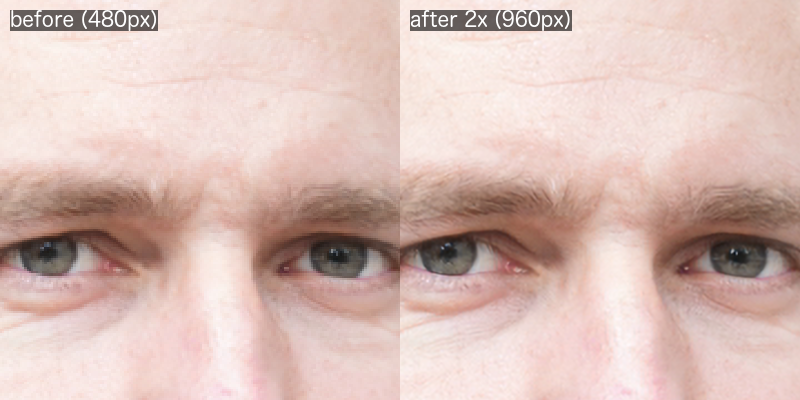

#  img-upscale

Right-click an image and upscale it 2x, 4x, 8x or 16x on your own machine

Windows · macOS

<!-- media: hero -->

<!-- /media: hero -->

## What it is

This upscales an image locally using a Swin2SR model. Rather than one big jump it does it in 2x steps, so 4x is two steps, 8x is three and so on.

It pops up a little window asking which scale you want, then saves the result next to the original in the same format. If you'd rather go quicker there's a fast backend that uses Real-ESRGAN instead.

The window is a console on Windows. On macOS, run it from your terminal.


## Get it

Paste this into your AI coding agent (Claude Code, Codex, Cursor...):

> Clone https://github.com/mikecann/img-upscale and make it my own. It's one of Mike
> Cann's personal tools, so read the README first, change anything specific to his
> setup to suit mine, then help me get it running.

### Or set it up by hand

You'll need Git and Python 3.10 or newer. No API keys or `.env` file are needed.
The first quality-backend run downloads `caidas/swin2SR-lightweight-x2-64`
from Hugging Face, so you'll need an internet connection for that first run.

Clone the repo:

```sh
git clone https://github.com/mikecann/img-upscale.git
cd img-upscale
```

On Windows, make sure Python is on PATH, then run in PowerShell:

```powershell
python -m venv .venv
.\.venv\Scripts\python.exe -m pip install torch
powershell -NoProfile -ExecutionPolicy Bypass -File install.ps1
```

The installer runs `deps.ps1` to install missing packages and check PyTorch.
It creates command stubs in `C:\dev\tools`, offers to add that folder to your
User PATH and adds **Mike's Tools > Upscale Image** to the classic Explorer menu.
Open a new terminal after installing. Use `-SkipDeps` to just refresh the stubs
and menu. You can set a different stub folder with `-ToolsDir "C:\my-tools"`.

The commands above install CPU-capable PyTorch. If you want CUDA acceleration,
install the appropriate build using the [PyTorch setup page](https://pytorch.org/get-started/locally/)
with `.\.venv\Scripts\python.exe -m pip`, then rerun `deps.ps1`.

On macOS:

```sh
python3 -m venv .venv
.venv/bin/python3 -m pip install -r requirements.txt
bash install.sh
```

This symlinks `img-upscale` into `~/.local/bin`. Add that folder to your shell's
PATH if needed, or pass another folder to `bash install.sh /path/to/bin`.
Both launchers use the clone's `.venv` when present, so you don't need to activate
it each time. Keep your clone where it is; rerun the installer if you move it.

## Using it

```sh
img-upscale photo.png
img-upscale photo.png --scale 2
img-upscale photo.png --scale 8
img-upscale photo.png bigger.png --scale 4
img-upscale photo.png --backend fast --scale 4
```

With no `--scale`, it asks for a scale in the console. Enter `2`, `4`, `8` or
`16`, or press Enter for `2x`. The existing prompt text only mentions `2` and `4`,
but all four values work.

On Windows, right-click an image file and choose **Mike's Tools > Upscale Image**.
On Windows 11, click **Show more options** first to get the classic menu.

Output goes next to the original as `photo_x4.png`, keeping the original extension.
If that file exists, it uses `photo_x4_2.png` instead of overwriting it. An explicit
output path lets you choose a different format and can overwrite that destination.

## Backends and settings

The default `quality` backend needs `torch`, `transformers`, `huggingface-hub`,
`safetensors`, `numpy` and `Pillow`, listed in `requirements.txt`.

| Scale | Quality steps |
| --- | --- |
| 2x | One 2x step |
| 4x | Two 2x steps |
| 8x | Three 2x steps |
| 16x | Four 2x steps |

Quality inference uses CUDA when available and CPU otherwise, including on macOS.
The default is 512-pixel tiles with 32-pixel overlap. Try `--tile-size 256` if
you run out of memory. Tile sizes must be at least 64 and a multiple of 8.
Large scales take more time and memory as each step processes a larger image.

The optional `fast` backend uses `realesrgan-x4plus`. On Windows, extract
`realesrgan-ncnn-vulkan.exe` and its `models` folder into `C:\dev\tools`
(or your chosen `-ToolsDir`). `deps.ps1` checks the default Windows location.
On macOS, keep `realesrgan-ncnn-vulkan` and its `models` folder outside the clone
and set `EXEDIR` to that folder:

```sh
EXEDIR=/path/to/realesrgan img-upscale photo.png --backend fast --scale 4
```

The Windows installed stub sets `EXEDIR` to its own folder. Running the repo's
launcher directly respects your existing `EXEDIR`, or falls back to the repo root.

## Troubleshooting and development

If quality dependencies are missing, rerun `deps.ps1` on Windows or
`.venv/bin/python3 -m pip install -r requirements.txt` on macOS. If PyTorch is
missing on Windows, install it in `.venv` first; `deps.ps1` reports it but leaves
the choice of CPU or CUDA build to you.

Run the tests without downloading models:

```sh
python3 -m unittest discover -s tests -v
```

On Windows use `python` instead of `python3`. To include the two tensor tests,
use your `.venv` interpreter with torch, numpy and Pillow installed. The tests
use fake inference data. CI runs the tests on macOS and Windows, checks Python
and shell syntax, and parses every PowerShell script on Windows.

To uninstall on Windows:

```powershell
powershell -NoProfile -ExecutionPolicy Bypass -File uninstall.ps1
```

If you used `-ToolsDir`, pass the same folder when uninstalling. This removes only
img-upscale's stubs, icon and Explorer verbs. The shared submenu and PATH stay in
place for other tools. On macOS, remove the symlink with
`rm ~/.local/bin/img-upscale`, or from your chosen install folder.

## More tools

More of my tools are at [mikerosoft.app](https://mikerosoft.app).

MIT licensed.
